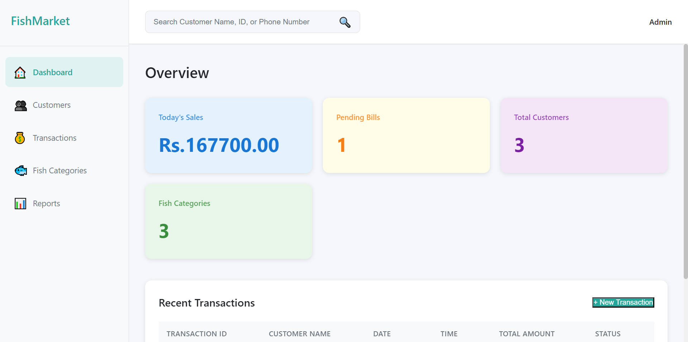
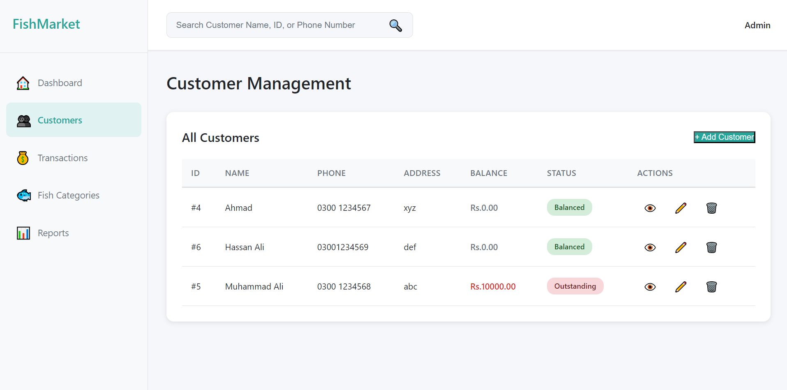
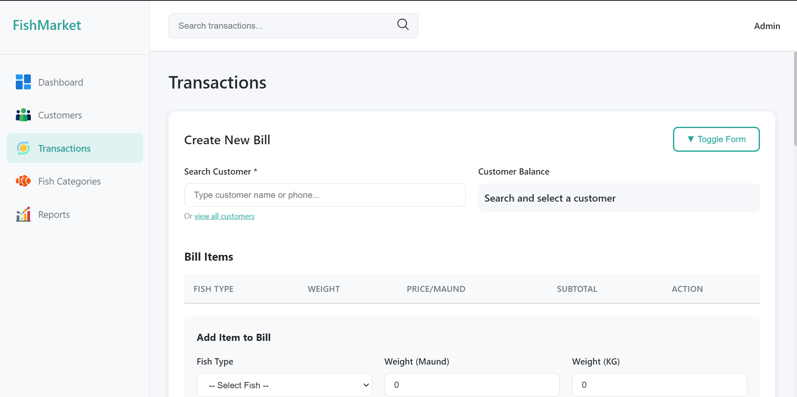
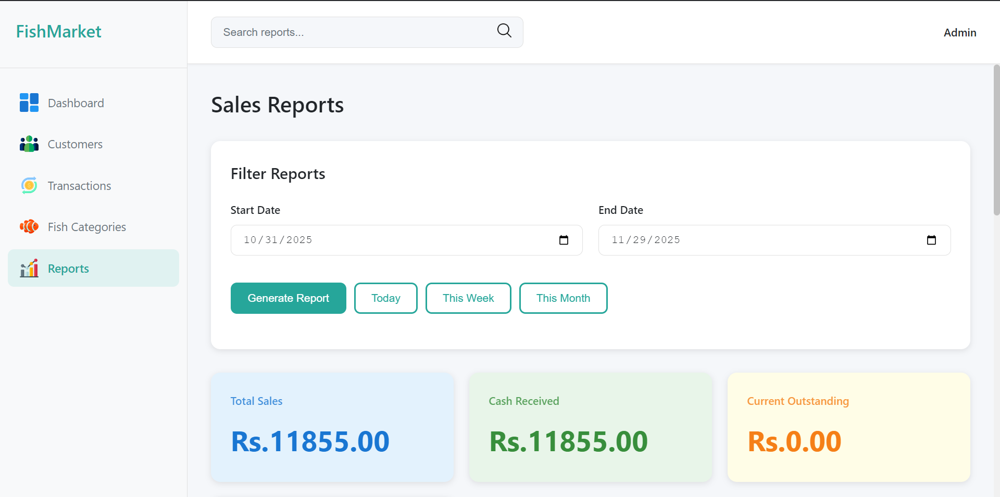

# Fish Market Inventory Management System

A desktop application built with Electron for managing fish market inventory, customers, and transactions.

## Features

- Customer account management with balance tracking (outstanding/prepaid)
- Fish category management with pricing
- Transaction/billing system with multi-item support
- Daily sales reports and summaries
- SQLite database for reliable data storage
- Portable across Windows PCs

## Screenshots

### Dashboard


### Customer Management


### Transaction/Billing


### Fish Categories


### Reports


## Installation

1. Install dependencies:
```bash
npm install
```

2. Run the application:
```bash
npm start
```

## Building for Distribution

Create installer and portable executable:
```bash
npm run build:win
```

The built application will be in the `dist/` folder.

For detailed build instructions, see [build-instructions.md](build-instructions.md).

## Project Structure

```
Fish-Project/
├── main.js              # Electron main process
├── preload.js          # Electron preload script (IPC bridge)
├── package.json        # Dependencies and scripts
├── src/
│   ├── index.html      # Dashboard page
│   ├── pages/          # Other pages
│   ├── css/            # Stylesheets
│   ├── js/             # JavaScript modules
│   └── assets/         # Images and icons
└── database/           # SQLite database files
```

## Database Schema

- **customers**: Customer information and balance
- **fish_categories**: Fish types and pricing
- **transactions**: Transaction headers
- **transaction_items**: Transaction line items
- **daily_summary**: Daily sales summaries

## Usage

1. **Add Customers**: Go to Customers page to add customer details
2. **Manage Fish**: Set up fish categories and prices
3. **Create Transaction**: Select customer, add fish items, calculate bill
4. **Track Balances**: System automatically tracks outstanding/prepaid amounts
5. **View Reports**: Check daily summaries and sales reports

### Dashboard Navigation

Click on any metric card to navigate to the relevant page:
- **Today's Sales** → Reports page
- **Pending Bills** → Customers with outstanding balances
- **Total Customers** → All customers
- **Fish Categories** → Fish management

### Outstanding Balance Tracking

The system now correctly tracks outstanding balances:
- When a customer's outstanding is cleared (balance becomes 0), reports will reflect this
- Outstanding in daily reports shows NET outstanding created that day
- Current outstanding customers are shown in the Reports page

**Note**: If upgrading from an older version with existing data, the outstanding balance logic has been improved. New transactions will use the correct calculation automatically.

## License

APACHE 2.0

